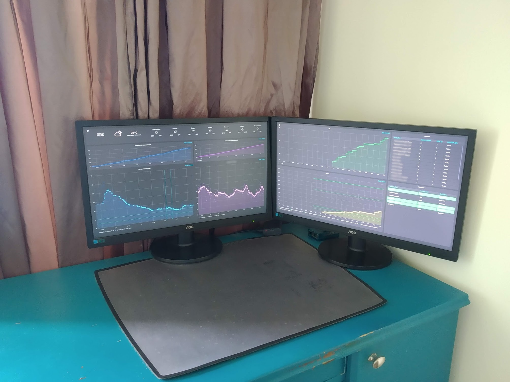
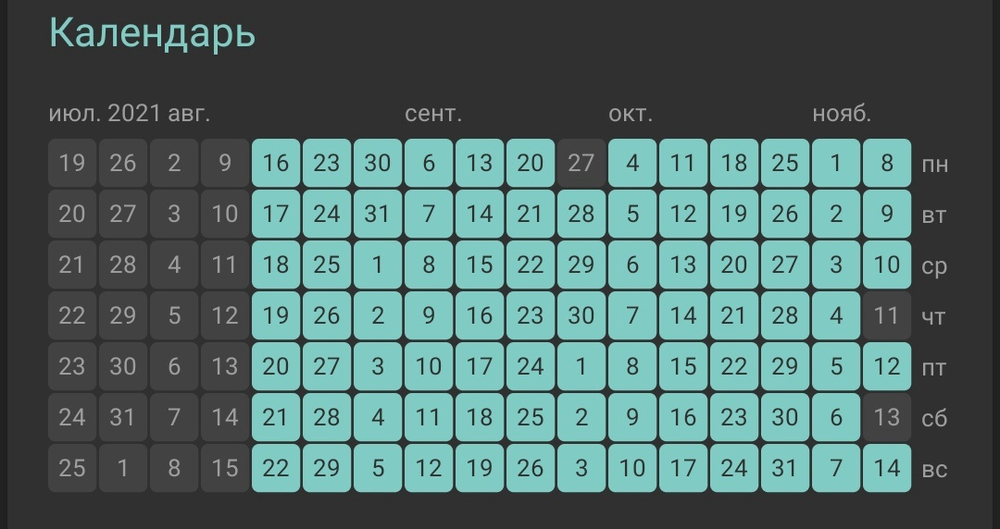

A long time ago, when I was preparing for my final exams in school, I suddenly began to gain weight.
This was probably mainly because I was very serious about passing my exams and even gave up my
regular basketball lessons so as not to be distracted from studying. The weight increased, but it
did not bother me so much that I did not notice the weight gain until I saw the graduation photos.

When I got to university, I decided to go to the gym to work out and lose weight. My friends made
rapid progress in terms of muscle mass and strength, while I hardly achieved any results and went to
the gym less and less often.

## Starting the fight, counting calories

Being a very stubborn person and also a technician, I quickly found out that exercise means nothing.
The only thing that really matters is the second law of thermodynamics, which states that calories
are extracted from the body when the effort is greater than the return.

The ingenious solution that came to me in my sleep was to go on a diet. I decided that I could "dry
out" faster if I started counting the calories of everything I ate. And I gave up very quickly. I
lasted about a month and a half. Counting took so much of my time and brain power that I started to
make my diet very predictable. So much so that it successfully included buckwheat, chicken, cottage
cheese, eggs and oatmeal in the morning. The idea of a varied diet was something of a fad for me.
Let the future me worry about that, now I have to lose weight.

## It didn't work the first time

Eventually, the session came and I could no longer be bothered with counting calories, caffeine and
sugar became my best friends. Lack of sleep, heaps of anxiety, and complete lack of time led me to
reach for unhealthy food as quickly and confidently as it then stayed with me.

There was more than one such iteration. I became terribly nervous when my calorie counts failed when
I did not start cooking when I forgot to weigh an item while cooking. And it started robbing me of a
bunch of concentration that I had to spend somewhere.

In the end, I came to simpler options - simple
diets. [Keto](https://en.wikipedia.org/wiki/Ketogenic_diet) and no-carb diets (where you cut out all carbs and eat
only protein and fats) were very effective in the short term. But as time went on, I got sad and
just started gaining weight again. Each time it got worse.

## Losing weight as a project

When I found a full-time job, I started doing things differently: I learned the basics of management
and systems thinking and started building a feedback loop. I measured my weight every day by
standing on the scale as a basic habit.

When you are constantly focused on your goal, you think more about how to optimize your weight
metrics. It really worked, I could spend half the day thinking about what I could do to lose weight.
For example, replace breakfast by taking casein, a complex protein that takes a long time to digest,
which makes you feel full for a long time, making you less likely to eat something high in calories.

And I really did lose weight, did not I?

Then I decided to build healthy habits, like exercising every day. I used behavioral psychology and
found [an app](https://play.google.com/store/apps/details?id=com.levor.liferpgtasks&hl=en_US&gl=US)
that allowed me to build a reward system that motivated me to exercise. I got coins for every
exercise I did, and when I had enough, I bought myself a luxury item that I would not have just
bought myself. So I bought a robot vacuum cleaner so I could reflash it and make it drive cursing
when it hit obstacles. Well, and if he would clean, that would not be bad either.

## Controlling weight and habits as a system

As a true data programmer, I have also set up a data acquisition system, storage, connected data
acquisition from MI -tape, an electronic scale, and a continuous sugar control system.

The culmination of my control addiction was that I set up two monitors in a room connected to a
Raspberry Pi, a smart socket that turned them on according to a schedule, Grafana on whose graphs I
displayed all the indicators: weight, average sugar level, number of gold coins, physical activity
graphs. There were also large panels that turned red when I was not weighing myself. When I reached
my daily goal, I would get a green dashboard and an increase in coins. But it got crazier and
crazier.

## Here we go again

I enjoyed it all very much and it worked well until I went away for three weeks. At first, the habit
of watching everything I did on the monitor began to destroy my motivation. I just lost the feedback
loop that kept my system going. It turned out that there was no floor scale where I was going, and
my mother and family, who had not seen me in a while, completely ignored my strict eating rules. For
three weeks, everything went wrong. I simply could not do the exercises I needed because the
equipment, like the dumbbells I had bought at home, was not there.

And when I came back, everything was different. I noticed that the weight had increased, the pennies
were getting worse, the motivation had decreased a bit.Suddenly I discovered the disadvantages of
constantly having a metric monitor in my life and weighing myself every day. I brainwashed myself
and started reducing my success and individuality to two metrics: weight and ability to adhere to a
system. The pennies that led me to the rewards I was not particularly keen on became more
significant than what it was actually about.

The more vacations I had, trips to see family with work from home, days when I was sick, the less
this system motivated me.

In the end, I gave up.

The weight started to increase. Just when I got sick with Covid, I was in bed for a month and a
half. Six months later I marked +20 kg.

## Addressing systemic issues

I picked up a psychologist and started talking about the hyper-control that had gotten me into this
situation. After thinking about it, I realized that constantly focusing on my weight and reaching
for it was really breaking me. In this mindset, if you do not weigh as much as you "should", you are
a failure. And when you think that way about yourself, people around you start doing the same
because your self-esteem flies into the abyss.

I have come to realize that you can not look at weight. Anything other than such a poorly controlled
metric. Because then the amplitude of the fluctuation of self-esteem would be as large as the
extremes of the weight range.

I decided to focus on habits that would make the weight go down, but I did not put it on a pedestal.

I knew that just starting to do something would not work for me for long. Measure calories, please,
but only until the first meal that breaks it all down. Lifting dumbbells every day for my biceps -
until I went on vacation for a few weeks.

## Consistency is more important than speed and ambition

But after a while it became clear to me. Then I saw it already in individual books
like "[Atomic habits](https://www.litres.ru/dzheyms-klir/atomnye-privychki-kak-priobresti-horoshie-privychki-i-izbavit/)"
or "[MINI habits - MAXI results](https://www.litres.ru/stiven-gayz/mini-privychki-maxi-rezultaty-22637504/)"
, which confirmed my thoughts. The most important value in supporting systems is consistency. Not
completeness, not ambition, but consistency.

If you can afford to break the rules of the system, you challenge the legitimacy of its existence.

It's like cigarettes: The best way to quit smoking is to just quit and not smoke again under any
pretext. Not just a little bit, not drunk. Just do not smoke. Once you break the new rule, this
precedent becomes very costly and increases the likelihood that you will resume the bad habit many
more times. Maybe even hundreds of times.

## How can you build a system to make it work

If you describe the rules of the system in such a way that it is possible to follow them at any
time, the system will be difficult to break.

For example, to implement push-ups, you can do one push-up every day. But every day. Over time, once
you have internalised it, you can raise the minimum threshold, but you must always make sure that
you are consistent.

## My results

For a long time, I had a desire to develop my writing skills. I opened
a [Telegram channel](https://t.me/dvvolynkin), started writing a post every day, and participated
in the [Content Hero](https://contenthero.me/s16#d9f10d80e4264dfeb8acee64cd5654e0) challenge, which
involved writing a post of at least 400 characters every day. This was relatively easy and created a
foundation for consistency.

Then I added push-ups. To my surprise, after a few weeks, I felt the urge to move more, so I went to
squash. I still do push-ups every day, a few times a week it's already a full-fledged workout at
home.

To develop a systematic control of my diet, I started to write down the last meal of the day and
then also write down the calorie count. On 4/7 days a week, I write down everything I ate in a day.

To write long articles, I have been trying to write at least 10 words a day. It's getting more and
more, although the conclusion always needs to be rewritten. But you end up knowing exactly what the
structure is and how you are going to write everything.

## What problems I encountered

Well, first of all, it's very hard not to even play hooky. Sometimes you are just lazy or an
important point is eaten up by something else. But even a few missed days make an incredible
difference in the overall difficulty of getting back to regular work. It's only a fraction of the
difficulty now.

So if you are sitting in the bar and forget to write down calories or write a post in the evening,
the legitimacy of your campaign is undermined a bit, making it less important. And if you put
together a combination of such events, it becomes a serious threat.

## What I learned along the way

I have come to realize that consistency is more important than numbers and results. I also realized
that it takes a few years to notice real change.

I realized that the system of rewards for doing habits works, but in the long run it distracts from
the original essence of doing. It also does not provide the consistency and consistency needed. If
only at first.

In all this time, I have learned that any kind of pressure on yourself, whether it's a dashboard in
the middle of the room, willpower, or another person, works until the first fluctuation in life. If,
due to some circumstance, you do not have enough resources in the prefrontal cortex to make a
volitional decision, your established system will break down. And any pressure on yourself will put
one stone on top of another.

But unlike the previous point, I have learned that if you lower the standards of heroism, you are
much less likely to screw up. And it allows you to build more complex habits based on the habits you
already have.